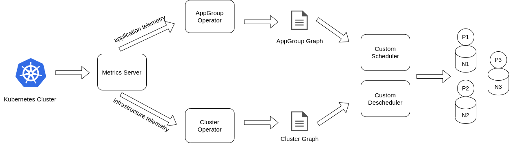

# **Sophos** - Infrastructure and Application Aware Orchestration  

The Sophos framework runs on top of the Kubernetes platform and extends its orchestration and scheduling strategy to adapt its usage to dynamic Cloud-to-Edge continuum environments.

The Cloud-to-Edge continuum is a distributed environment made up of heterogeneous nodes with different computational and networking resources. Edge nodes are typically resource and bandwith constrained nodes and the network latency between them is not a negligible factor. 

In this context one limitation of the Kubernetes platform is that it does not evaluate the run time cluster and application states when making scheduling decisions for application Pods, neither reschedules Pods based on state changes. This can limit performances and increase SLA violations for applications deployed in Cloud-to-Edge continuum environments.

To deal with those limitations Sophos implements a dynamic infrastructure and application aware orchestration and scheduling strategy with the aim to adapt the application deployment based on the ever changing cluster network conditions and user requests distribution among application microservices.

Sophos includes the following components:

- **AppGroup operator**: this is a Kubernetes operator that based on the application metrics collected from a metrics server, determines an appGroup graph. The appGroup graph contains the set of application microservices, each with its current CPU and memory usages, and the communication channels between them.

- **Cluster operator**: this is a Kubernetes operator that based on the cluster metrics collected from a metrics server, determines a cluster graph. The cluster graph contains the set of cluster nodes, each with its currently available CPU and memory, and the communication links between them.

- **Custom scheduler**: based on the run time appGroup and cluster graphs, the custom scheduler defines a placement for each application Pod with the aim to minimize the network distance between Pods that exchange high amounts of traffic, while at the same time reducing the shared resource interference between them.

- **Custom descheduler**: based on the run time appGroup and cluster graphs, the custom descheduler reschedules Pods if better scheduling decisions can be taken for them.

To install the framework head over to the [installation](doc/install.md) guide.

